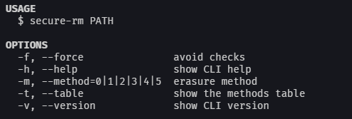

[](https://npmjs.org/package/secure-rm)
[](https://npmjs.org/package/secure-rm)
[](https://github.com/MaelAcier/secure-rm/blob/master/package.json)
[]()

**WARNING** THIS TOOL IS STILL IN DEVELOPEMENT, USE IT AT YOUR OWN RISKS!
The documentation is not complete either.

Completely erases files by making recovery impossible.

# Installing

You can use this package in two different ways, the _npm module version_:

```shell
$ npm install secure-rm --save
```

Or the _command-line version_:

```shell
$ npm install secure-rm -g
```

# Getting started

If you want your application to delete specific files with a single pass (method 1), use this code snippet:
```javascript
const rm = require('secure-rm')

rm('./folder/*.js', '1', (err) => {
  if (err) throw err
  console.log('Success!')
})
```

If you want to delete files on the fly, just use the command line tool:
```shell
$ secure-rm ./folder/*.js
```

# Documentation

## npm module 

```javascript
rm(path, method, callback)
```
It will search for files if the path is a glob pattern, or the folder/file specified.
You have to specify a method, they are described below.
The function (asynchronous) then run the callback when all the files has been removed.

## Command line tool

```shell
$ secure-rm <PATHS> [OPTIONS]
```
The tool supports file globbing and multiple arguments like:
```shell
$ secure-rm ./folder/*.js ./garbage ./file.js
```
The different flags are detailed in the built-in help:
```shell
$ secure-rm -h
```


## Developing

### Built With
List main libraries, frameworks used including versions (React, Angular etc...)

### Prerequisites
What is needed to set up the dev environment. For instance, global dependencies or any other tools. include download links.


### Setting up Dev

Here's a brief intro about what a developer must do in order to start developing
the project further:

```shell
git clone https://github.com/oganexon/secure-rm.git
cd secure-rm/
npm install
```

And state what happens step-by-step. If there is any virtual environment, local server or database feeder needed, explain here.

### Deploying / Publishing
give instructions on how to build and release a new version
In case there's some step you have to take that publishes this project to a
server, this is the right time to state it.

```shell
packagemanager deploy your-project -s server.com -u username -p password
```

And again you'd need to tell what the previous code actually does.

## Versioning

We use [SemVer](http://semver.org/) for versioning. For the versions available, see the [link to tags on this repository](/tags).


## Configuration

Here you should write what are all of the configurations a user can enter when
using the project.

## Tests

Describe and show how to run the tests with code examples.
Explain what these tests test and why.

```shell
Give an example
```

## Style guide

Explain your code style and show how to check it.

## Api Reference

If the api is external, link to api documentation. If not describe your api including authentication methods as well as explaining all the endpoints with their required parameters.


## Database

Explaining what database (and version) has been used. Provide download links.
Documents your database design and schemas, relations etc... 

## Licensing

State what the license is and how to find the text version of the license.

# Usage

# Commands

> Additional information or tag line

